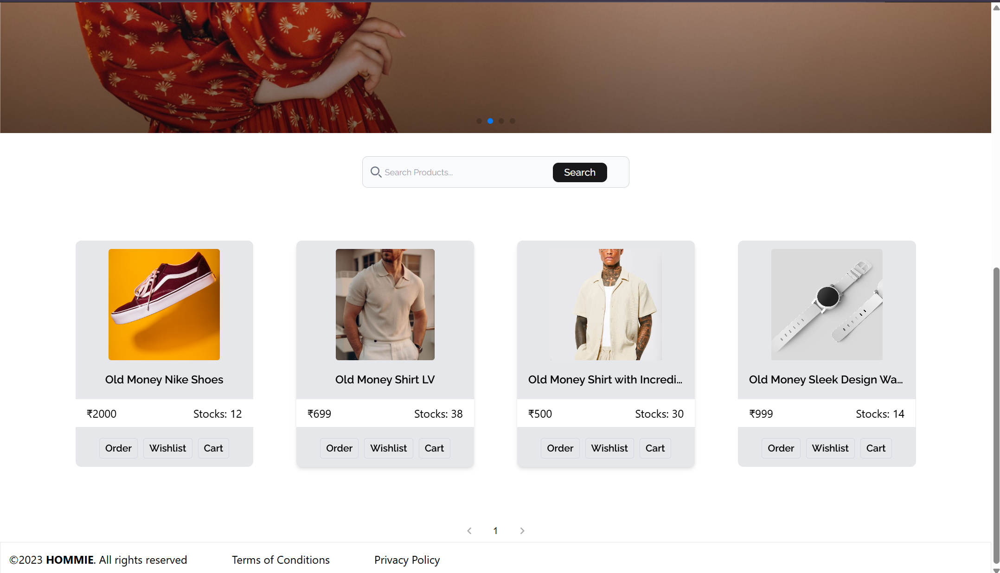
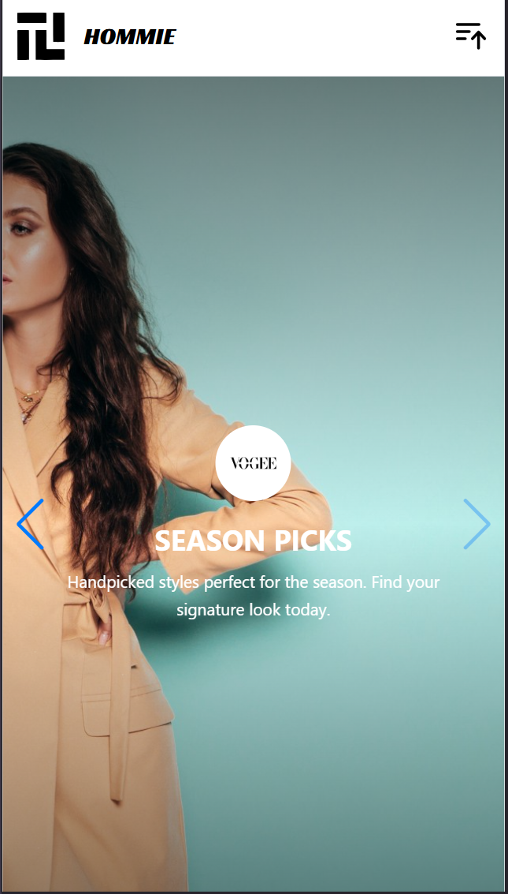
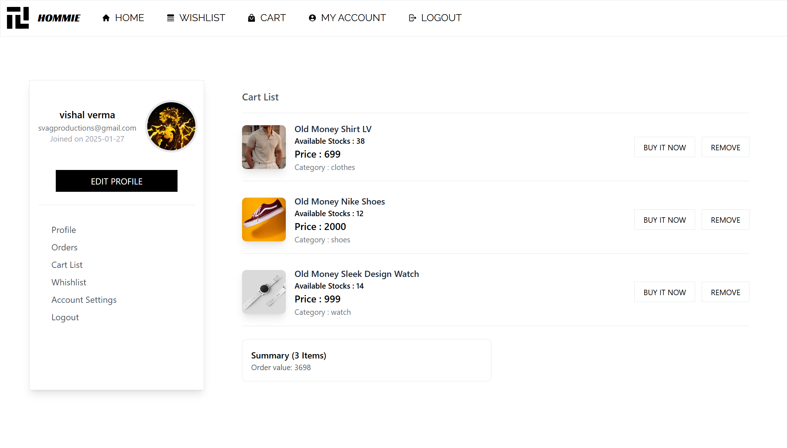
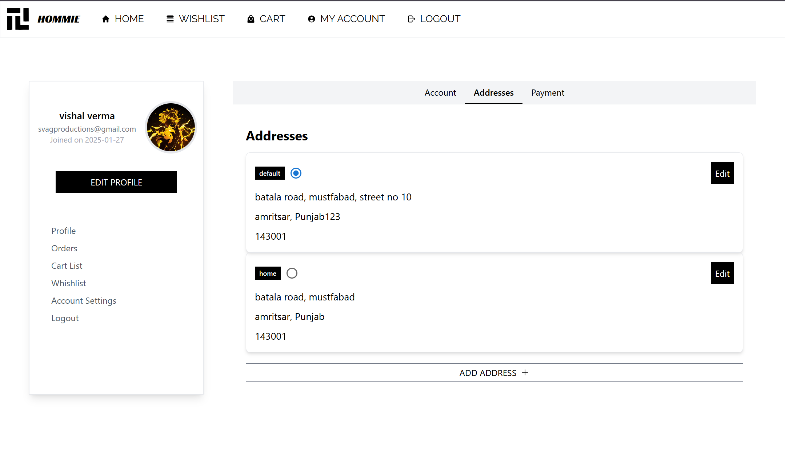
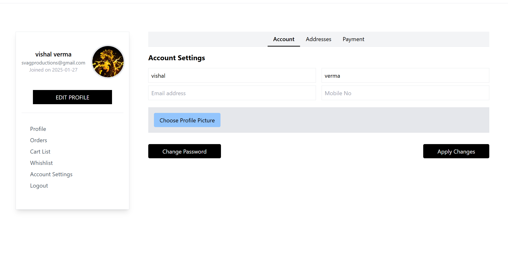

# HOMMIE Application Documentation

Welcome to the HOMMIE application! This document provides a comprehensive overview of the application, including backend API details, frontend integration, and UI screenshots.

---

## Table of Contents

- [Overview](#overview)
- [Installation & Setup](#installation--setup)
  - [Backend Setup](#backend-setup)
  - [Frontend Setup](#frontend-setup)
- [API Documentation](#api-documentation)
  - [User Routes](#user-routes)
  - [Product Routes](#product-routes)
- [UI Screenshots](#ui-screenshots)
- [Additional Information](#additional-information)

---

## Overview

HOMMIE is a full-stack application featuring user authentication, product management and e-commerce functionalities. The backend is built with Node.js and Express, while the frontend uses React with Vite. The API documentation is auto-generated using Swagger.

---

## Installation & Setup

### Backend Setup

1. **Environment Variables:**  
   Create a `.env` file in the `Backend` folder based on [envSample.txt]. For example:
   ```
   NODE_ENV=production
   DB_URI=<your_database_uri>
   JWT_SECRET=<your_jwt_secret>
   CLOUDINARY_API_KEY=<your_cloudinary_api_key>
   CLOUDINARY_SECERET=<your_cloudinary_secret>
   ```
2. **Install Dependencies:**
   Open a terminal in `c:\Users\Desktop\E-commerce-HOMMIE-SHOP\Backend` and run:
   ```
   npm install
   ```
3. **Run the Server:**
   ```
   node app.js
   ```
   The application will start on port 3000.

4. **API Documentation:**  
   The API docs are served at: [http://localhost:3000/api-docs](http://localhost:3000/api-docs)

### Frontend Setup

1. **Install Dependencies:**  
   Open a terminal in `c:\Users\surface\Desktop\Owner avatar
E-commerce-HOMMIE-SHOP\frontend` and run:
   ```
   npm install
   ```
2. **Run the Application:**  
   Start the development server with:
   ```
   npm run dev
   ```
   The application will usually run on [http://localhost:3000](http://localhost:3000) or the port assigned by Vite.

---

## API Documentation

### User Routes

- **Sign Up:**  
  - **URL:** `/user/signup`  
  - **Method:** `POST`  
  - **Request Body:** `email`, `password`  
  - **Responses:**  
    - `201 Created`: User registered  
    - `400 Bad Request`: Invalid input

- **Login:**  
  - **URL:** `/user/login`  
  - **Method:** `POST`  
  - **Request Body:** `email`, `password`  
  - **Responses:**  
    - `200 OK`: Successful login  
    - `401 Unauthorized`: Invalid credentials

- **Send Mail, Email Token Verification, OTP Verification, Forgot Password, Reset Password, Update Password, Address, Profile Picture, Add to Cart, Add to Wishlist:**  
  Refer to the [backend API docs](http://localhost:3000/api-docs) or the detailed comments in the source code for further details.

### Product Routes

- **Get All Products:**  
  - **URL:** `/products`  
  - **Method:** `GET`  
  - **Response:** `200 OK` with list of products

- **Get Product by ID, Create Product, Update Product, Delete Product:**  
  Details including URL parameters and request bodies are documented in the backend API. Visit [http://localhost:3000/api-docs](http://localhost:3000/api-docs) for more information.

---

## UI Screenshots

Below are some screenshots that represent various UI pages of the application. These images are sourced from the `screenShotsUI` folder.

### Home Page (Desktop)



### Home Page (Mobile)


### Cart List Page (Desktop)


### Edit Address Page (Desktop)


### Edit Profile Info Page (Desktop)


*Add additional screenshots here as required.*

---

## Additional Information

- **Logging & Errors:**  
  Errors and status messages are handled via `textStatusCode.js` in the backend, which maps various HTTP status codes to text descriptions.

- **Swagger Documentation:**  
  The Swagger file [swagger-output.json](c:\Users\surface\Desktop\E-commerce-HOMMIE-SHOP\Backend\swagger-output.json) is generated by [swagger.js](c:\Users\surface\Desktop\E-commerce-HOMMIE-SHOP\Backend\swagger.js) and provides a detailed interface for all API endpoints.

- **Frontend Structure:**  
  The frontend uses React with Vite. Key components include the user profile page, product listing components, and header/footer components.

- **Deployment:**  
  Ensure that environment variables are properly set in production and that both frontend and backend servers are running.

---

Happy coding!
VISHAL